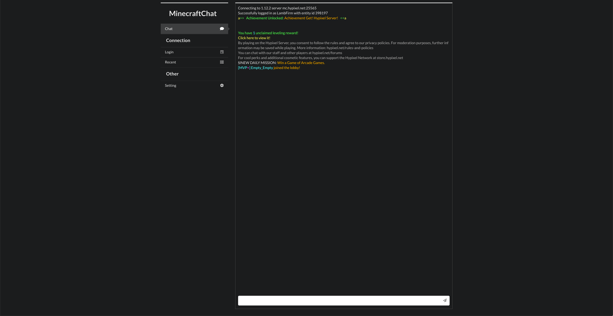

# MinecraftChat

By connecting to any minecraft server, both offline and online mode, it enables you to send commands and receive text messages in a fast and easy way without having to open the heavyweight Minecraft game.



## Featrue & TODO

- [x] Use browser to login minecraft server both online-mode and offline-mode.
- [x] Chat with other player and send commands to the server like in minecraft.
- [x] Receive messages from server with text coloring!
- [x] Make bot auto respawn when bot dead.
- [x] Use database to cache bot login session and use it to login before session expired
- [ ] Display event message, like weather change, attacked by monster...
- [x] Display bot state, like health, hunger, armor, and xp bar.
- [ ] Display server state, like online player, scoreboard...
- [ ] Can write a script to control bot.

## Download

```bash
git clone https://github.com/WooLNinesun/MinecraftChat.git
```

## Install and Run application:

### Manual

Copy `.env.example` to `.env` and set environment variable in the file.

```bash
npm install && npm run build && npm run start
```

Open browser and type url `localhost:${port}` to  use application. `${port}` defined in `.env` file, default is 3000.

`Ctrl+C` to stop the minecraft chat server

### Docker-compose (recommand)

1. Copy `docker-compose.example.yml` to `docker-compose.yml` and edit this file with your config.
2. File `docker-compose.yml` in `dockers/production`, can build and run it in docker-compose

```bash
docker-compose --file dockers/production/docker-compose.yml up -d application
```

Open browser and type url `localhost:${port}` to  use application. `${port}` defined in `docker-compose.yml` file, default is 3000.

To stop the minecraft chat server

```bash
docker-compose --file dockers/production/docker-compose.yml down application
```

## Run test minecraft server (Optional)

Create simple minecraft server for test. Also can connect to others minecraft server

### Manual

Download official minecraft server jar to create server. [Tutorials](https://minecraft.gamepedia.com/Tutorials/Setting_up_a_server)

### Docker-compose (recommand)

1. Copy `config.example.env` to `config.env` and set variable in the file.
2. File `docker-compose.yml` in `dockers/production`, can build and run it in docker-compose

```bash
docker-compose --file dockers/production/docker-compose.yml up -d minecraft-server
```

To stop the minecraft chat server

```bash
docker-compose --file dockers/production/docker-compose.yml down minecraft-server
```

## Framework used
* Next.js - The React and Express Framework
* Socketio - Communicate between client and server
* Semantic-ui-React - A UI component framework
* lowdb - Small local JSON database powered by Lodash
* mineflayer - Create Minecraft bots with a powerful, stable, and high level JavaScript API.

## Thanks for Contributor
* [henlium](https://github.com/henlium) - Correct my readme's typo and grammar.
